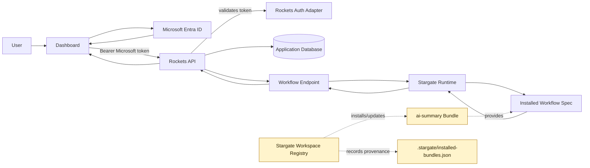

# Rockets Starter

Monorepo boilerplate: NestJS 11 API (`@bitwild/rockets` v2 DSL) + Next.js frontend, managed with Turborepo.

## Quick start

```bash
yarn install
cp apps/api/.env.example apps/api/.env
yarn dev
```

| App | URL |
|-----|-----|
| Web | http://localhost:3000 |
| API | http://localhost:3001 |
| Swagger | http://localhost:3001/api |

## What's inside

- **`apps/api`** — NestJS backend, SQLite, Microsoft auth adapter, module-based DDD layout
- **`apps/web`** — Next.js + Tailwind
- **`packages/`** — shared ESLint and TypeScript configs

## Architecture

The browser talks only to Rockets API. Rockets owns authentication, database access, and the API boundary. Stargate runs behind Rockets as an in-process workflow runtime.



Key boundaries:

- **Microsoft token** authenticates user requests from the dashboard to Rockets API.
- **Rockets API** is the only backend exposed to the browser.
- **Stargate Runtime** executes workflows in-process through `@stargate/server`.
- **Workspace Registry** is future asset distribution/provenance, not auth and not runtime.
- **MCP trust** belongs to registry-installed MCP presets only; it is separate from user login.

Today, `.stargate/flows/ai-summary.json` is a local workflow asset. When Workspace Registry lands, that flow should come from an installed bundle and be tracked in `.stargate/installed-bundles.json`.

See [docs/stargate-workspace-registry-analysis.md](docs/stargate-workspace-registry-analysis.md) for the detailed decision record.

## Scripts

- `yarn dev` — all apps
- `yarn dev:api` / `yarn dev:web` — single app
- `yarn build` — production build
- `yarn type-check` — TypeScript
- `yarn lint` — ESLint

## development-guides/

Markdown guides in this folder describe **legacy v7 patterns** (manual CRUD adapters, Postgres, rockets-auth). For the current v2 DSL, use [btwld/skills](https://github.com/btwld/skills) instead.

## Next steps

- Install the `ai-summary` workflow through Workspace Registry when it is available
- Add modules under `apps/api/src/modules/`
- Extend `apps/web`
- Tests: `cd apps/api && yarn test && yarn test:e2e`
