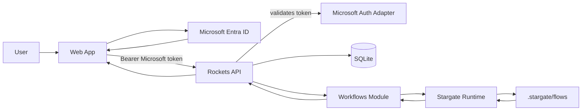

# Rockets Starter

Monorepo boilerplate: NestJS 12 API (`@concepta/rockets` `0.0.1-dev.0`) + Next.js frontend, managed with Turborepo.

Clean starter for a new project: Microsoft Entra ID auth, user metadata, and a single **workflows** module backed by Stargate.

## Quick start

```bash
yarn install
cp apps/api/.env.example apps/api/.env
# set MICROSOFT_TENANT_ID / MICROSOFT_CLIENT_ID in apps/api/.env
# set NEXT_PUBLIC_MICROSOFT_TENANT_ID / NEXT_PUBLIC_MICROSOFT_CLIENT_ID for the web app
yarn dev
```

| App | URL |
|-----|-----|
| Web | http://localhost:3000 |
| API | http://localhost:3001 |
| Swagger | http://localhost:3001/api |

## What's inside

- **`apps/api`** — NestJS 12 + `@concepta/rockets`, SQLite, Microsoft Entra ID, Stargate workflows
- **`apps/web`** — Next.js 16 + MSAL login, profile, artifacts UI
- **`packages/`** — shared ESLint and TypeScript configs

## Architecture

The browser talks only to Rockets API. Rockets owns authentication, database access, and the API boundary. Stargate runs behind Rockets as an in-process workflow runtime.



Key packages (npm):

- [`@concepta/rockets`](https://www.npmjs.com/package/@concepta/rockets)
- [`@concepta/rockets-core`](https://www.npmjs.com/package/@concepta/rockets-core)
- [`@concepta/rockets-repository-typeorm`](https://www.npmjs.com/package/@concepta/rockets-repository-typeorm)

`@stargate/*` is still linked from a sibling local checkout via yarn resolutions.

## Modules

- **`user-metadata`** — `/me` profile fields
- **`stargate`** — generic workflow runtime boundary
- **`workflows`** — sample typed workflow (`ai-summary`) + generic flow catalog / publish / MCP

Add domain modules under `apps/api/src/modules/` and register them in `RocketsModule.forRoot({ resources: [...] })`.

## Scripts

- `yarn dev` — all apps
- `yarn dev:api` / `yarn dev:web` — single app
- `yarn build` — production build
- `yarn type-check` — TypeScript
- `yarn lint` — ESLint
- Tests: `cd apps/api && yarn test && yarn test:e2e`
