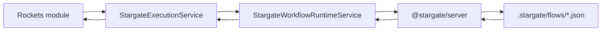

# Stargate Module

The Stargate module is the workflow boundary inside Rockets.

Rockets owns auth, HTTP, persistence, scheduling, and application decisions. Stargate owns workflow execution. External systems such as Zoho should be reached by Stargate workflows, then Rockets receives normalized results and decides what to save or show.

## Runtime Flow



## Module Contract

Register workflow definitions with `StargateModule.register`.

```ts
@Module({
  imports: [
    StargateModule.register({
      workflows: [budgetWorkflow, featureEstimateWorkflow],
    }),
  ],
})
export class BudgetModule {}
```

`workflows` are not the workflow JSON files. They are API mapping objects that define:

- `key`: internal catalog key.
- `flow`: Stargate flow id, usually matching `.stargate/flows/<flow>.json`.
- `toInputs`: maps Rockets input into Stargate inputs.
- `parseResults`: validates raw Stargate output.
- `toOutput`: maps validated workflow results into an application result.

## Workflow Definition

```ts
export const budgetWorkflow: StargateWorkflow<
  BudgetWorkflowInput,
  BudgetWorkflowResults,
  BudgetWorkflowOutput
> = {
  key: 'budget',
  flow: process.env.STARGATE_BUDGET_FLOW ?? 'budget',

  toInputs: ({ requestId }) => ({ requestId }),

  parseResults: (results) => {
    const output = results.format?.output;

    if (!isBudgetOutput(output)) {
      throw new WorkflowOutputError(
        'Stargate workflow did not include results.format.output',
      );
    }

    return { format: { output } };
  },

  toOutput: ({ format }) => format.output,
};
```

## Responsibilities

Stargate module:

- Loads and executes installed Stargate flow specs.
- Converts runtime failures into domain errors.
- Keeps workflow execution behind a small Nest service API.
- Exposes `StargateExecutionService` to feature modules.

Feature modules:

- Own DTOs, entities, scheduling, persistence, and HTTP endpoints.
- Own workflow input/output interfaces.
- Decide what workflow result should be saved.
- Translate Stargate errors into user-facing responses when needed.

Workflow JSON files:

- Live under `.stargate/flows`.
- Describe workflow nodes and connections.
- Should return stable, normalized output shapes.

## Best Practices

- Keep external service details inside workflows when possible. Rockets should consume normalized results, not vendor-specific payloads.
- Validate workflow output in `parseResults`. Do not pass raw Stargate output into application code.
- Keep workflow definitions close to the feature that owns the use case.
- Keep `StargateModule` generic. Do not add Zoho, budget, auth, or dashboard logic here.
- Prefer explicit input/output interfaces per workflow.
- Throw `WorkflowOutputError` when the workflow result shape is wrong.
- Use environment variables for flow ids when a deployment needs to swap installed flows.
- Persist data in feature modules after workflow execution, not inside the Stargate module.

## Current Workflows

- `budget`: simulates pulling project budget and time data from Zoho Creator.
- `zoho-tasks`: simulates reading new incoming task requests from Zoho.
- `feature-estimate`: simulates code analysis and feature effort estimation using the latest budget context.
- `ai-summary`: summarizes submitted text through the installed AI summary flow.

## Adding a Workflow

1. Add a flow spec under `.stargate/flows/<flow-id>.json`.
2. Add input/output interfaces in the owning feature module.
3. Add a `StargateWorkflow` definition with strict `parseResults` validation.
4. Register it with `StargateModule.register({ workflows: [...] })`.
5. Call it through `StargateExecutionService.run(workflow, input)`.
6. Add an e2e test around the feature endpoint or scheduled use case.
