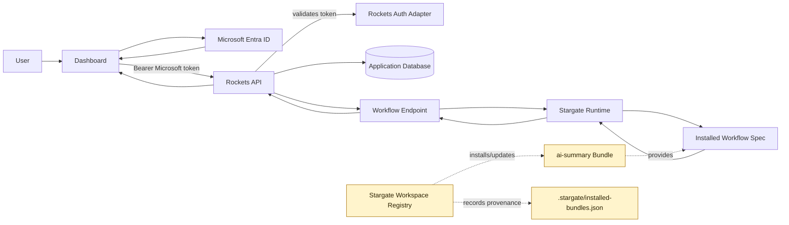

# Stargate Workspace Registry Analysis

Date: 2026-06-18

Source reviewed:

- Stargate discussion: `btwld/stargate#224` - "RFC: Workspace Registry"
- Local Stargate branch: centralized `@stargate/server` package work
- Rockets Starter integration: dashboard -> Rockets API -> in-process Stargate workflow execution

## Current Decision

Do not change the Rockets Starter execution architecture for the registry RFC.

The current integration should stay:

1. The browser authenticates with Microsoft Entra ID through MSAL.
2. The browser sends the Microsoft token to Rockets API as `Authorization: Bearer <token>`.
3. Rockets API validates the token through the Microsoft auth adapter.
4. Rockets API executes Stargate in-process through `@stargate/server`.
5. Stargate runs the local workflow spec and returns the result to Rockets API.
6. Rockets API returns the response to the dashboard.

Stargate should not be exposed directly to the browser in this starter.

## Architecture Diagram



Read it as two separate flows:

- Runtime request flow: dashboard -> Rockets API -> Stargate Runtime -> workflow result.
- Asset lifecycle flow: Workspace Registry -> bundle -> installed workflow + provenance.

Those flows touch at the installed workflow file, not at authentication.

## What The RFC Changes

The Workspace Registry RFC is about distribution and lifecycle of Stargate workspace assets:

- flows
- skills
- MCP server presets

It introduces bundles as the shareable unit, with:

- `stargate.json` manifest
- `.stargate/installed-bundles.json` provenance state
- content digests
- update/remove/diff/provenance commands
- explicit trust gate for MCP activation

This is not an auth layer and not a workflow runtime replacement.

## Impact On Rockets Starter

No immediate code change is required.

The current `.stargate/flows/ai-summary.json` is acceptable as a local starter asset for now. When Workspace Registry lands, this should become an installed bundle instead of a manually copied file.

Expected future shape:

```text
bundle: btwld/ai-summary
  stargate.json
  .stargate/flows/ai-summary.json
```

Then the starter would install the bundle and track it in:

```text
.stargate/installed-bundles.json
```

The API code should still load and execute the local installed flow. The difference is provenance and update safety, not runtime flow execution.

## Auth Boundary

Microsoft auth and Workspace Registry trust are separate concerns.

Microsoft token:

- authenticates the user
- is validated by Rockets API
- protects API routes
- is sent from frontend to backend on every request

Workspace Registry trust:

- applies to MCP server presets
- prevents untrusted local commands or external MCP endpoints from activating silently
- is not a user login mechanism
- should never be implied by `--yes`, `--force`, or normal bundle install

The starter should keep user auth at the Rockets API boundary and keep Stargate behind that boundary.

## Dependency Direction

The starter should import only the centralized Stargate server package:

```ts
import { filterStringEnvVars } from '@stargate/server';
import { StargateServerModule, WorkflowRunnerService } from '@stargate/server/nest';
```

The starter should not import Stargate internals directly:

- `@stargate/core`
- `@stargate/engine`
- `@stargate/components`
- `@stargate/ai_sdk`

Those can remain as transitive local workspace resolutions while Stargate packages are consumed via `file:` paths, but they should not be direct application dependencies.

## Future Work

When Workspace Registry is implemented:

1. Publish or author an `ai-summary` bundle.
2. Install it into this starter instead of copying `.stargate/flows/ai-summary.json` manually.
3. Keep the same Rockets API endpoint contract.
4. Add a provenance check in developer docs so the team can see which bundle/version owns the workflow.
5. Avoid activating bundle-provided MCP servers until the explicit registry trust step is complete.

## Non-Goals

Do not use the registry RFC to:

- bypass Microsoft auth
- expose Stargate directly to the frontend
- turn MCP trust into user authentication
- add direct dependencies on Stargate internals in the starter
- implement a package manager or version resolver inside Rockets Starter
